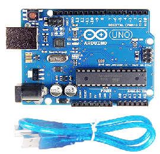

# **FULLY AUMATED DAM WITH EARTHQUAKE RESISTANT BUILDING**

Features

    1. An automatic water level monitor system.
    2. Automatic alert system when water level cross danger level.
    3. Auto control emergency gate.
    4. Earthquake resistance building.

Advantages

    1. Produce Hydroelectricity power.
    2. Monitors the DAM automatically every time.
    3. Always display the height of water level.
        A visual warming and alarm are there for alerting
        the people if the water level increases beyond a
        particular limit.
    4. Easy to setup.
    5. Fully automated system.
    6. Economical and reliable.

## Snapshoots of the project

## Major components

